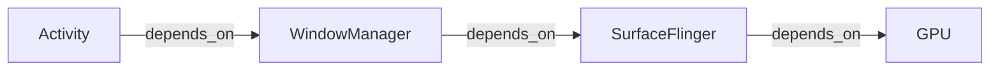

# Prompt: Dependency Graph

Represent "what depends on what" as a directed graph. When rendering visually (Mermaid, or the Visualizer tool if available), use this convention:

- Node = Object or Component
- Edge = depends_on (A -> B means A depends on B)

Mermaid example:

Rules:
- Keep direction consistent (always "depends_on", never mix in "produces" on the same graph — use separate graphs for separate edge types).
- Highlight the node(s) implicated by the current leading hypothesis.
- If the graph has a cycle, that's often diagnostically significant (potential feedback loop or deadlock risk) — call it out explicitly rather than just drawing it.
